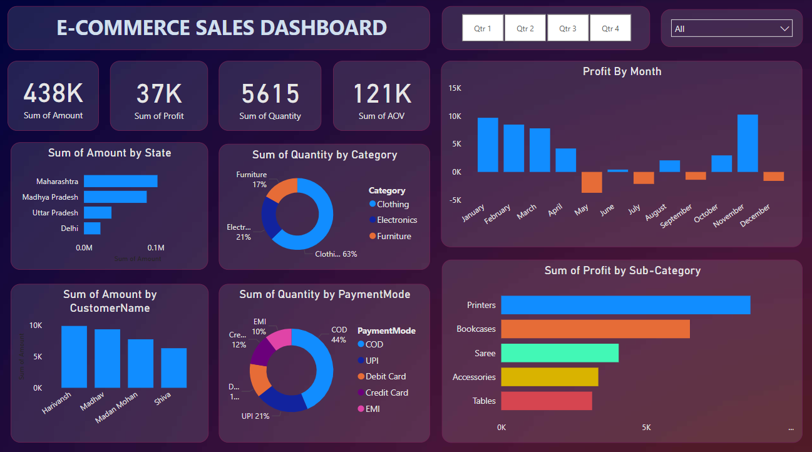

# Task 4: Dashboard Design



**Objective**: Design an interactive e‑commerce sales dashboard that delivers key business insights and allows stakeholders to explore data dynamically.

---

## 📁 File Structure
```plaintext
Task4_Dashboard_Design/
├── README.md                 # This file
├── Dashboard_pic.png         # Screenshot of the finished dashboard
├── Task4_Summary.pptx        # PPT summary of dashboard insights
```  

---

## 🧰 Tools & Data
- **Tool**: Power BI Desktop (latest version)  
- **Dataset**: `e_commerce_data.csv` (contains Order Date, Customer, Product, Category, Sub-Category, Amount, Profit, Quantity, Payment Mode, State)

---

## 🪜 Implementation Steps

1. **Get Data**  
   - In Power BI Desktop: **Home → Get Data → Text/CSV**  
   - Load `dataset/e_commerce_data.csv` and verify column types (Date, Text, Numeric).

2. **Data Preparation**  
   - In **Power Query Editor**:  
     - Remove errors and blanks.  
     - Change `Order Date` to `Date` type.  
     - Rename columns to concise names (e.g., `Amount`, `Profit`, `Qty`).  
     - Close & Apply.

3. **Create Measures (DAX)**  
   ```DAX
   Total Amount = SUM('e_commerce_data'[Amount])
   Total Profit  = SUM('e_commerce_data'[Profit])
   Total Quantity = SUM('e_commerce_data'[Qty])
   Avg Order Value = DIVIDE([Total Amount],[Total Quantity],0)
   ```

4. **Design Report Layout**  
   - **Title**: Add a bold header “E‑COMMERCE SALES DASHBOARD”.  
   - **KPI Cards**: Display `Total Amount`, `Total Profit`, `Total Quantity`, `Avg Order Value` at top.

5. **Add Visuals**  
   - **Profit by Month**: Column chart, blue for positive months, orange for negative, slicer-buttons for Q1–Qtr Q4 via bookmarks.  
   - **Sum of Amount by State**: Horizontal bar chart sorted descending.  
   - **Sum of Quantity by Category**: Donut chart showing share of Clothing, Electronics, Furniture.  
   - **Sum of Amount by Customer Name**: Vertical bar chart for top 4 customers.  
   - **Sum of Quantity by Payment Mode**: Donut chart for COD, UPI, Debit Card, Credit Card, EMI.  
   - **Sum of Profit by Sub-Category**: Horizontal bar chart highlighting highest-profit items.

6. **Interactivity & Filters**  
   - **Quarter Buttons**: Create bookmarks for each quarter and assign to Buttons (Qtr 1–Qtr 4).  
   - **Dropdown Slicer**: Add a slicer for Categories (All/Clothing/Electronics/Furniture).

7. **Formatting & Theme**  
   - Apply a **dark gradient background** and **high‑contrast visuals**.  
   - Use a **consistent font** (e.g., Segoe UI) and **accent colors** for bars and slices.  
   - Add data labels and tooltips for clarity.

8. **Publish & Share**  
   - Publish to **Power BI Service** (if desired).  
   - Export to **PDF** or **PowerPoint** for stakeholder distribution.

9. **Summary Presentation**  
   - In `Task4_Summary.pptx`, include:  
     1. Dashboard overview slide with screenshot.  
     2. Explanation of each visual and key insight.  
     3. Data sources & DAX measures.  
     4. Recommendations based on patterns observed.

---

## 🎯 Key Insights Highlighted
- **Monthly Profit Trends**: Identification of strong vs weak months; Q4 highest.  
- **Regional Performance**: Maharashtra leads in sales amount; opportunity areas in Delhi and UP.  
- **Category Breakdown**: Clothing drives 63% of quantity sold.  
- **Top Customers**: Harivansh and Madhav show the highest spend.  
- **Payment Preferences**: COD accounts for 44% of orders.  
- **Sub-Category Profit**: Printers and Bookcases deliver the most profit.

---

## ✅ Best Practices
- **KPIs & Cards** for at-a-glance metrics.  
- **Bookmarks & Buttons** for intuitive quarter filtering.  
- **Slicers** for flexible category exploration.  
- **Contrast**: Dark background with vibrant chart colors.  
- **Accessibility**: Clear labels, tooltips, and font sizing.

---

📤 **Deliverables**   
- Dashboard screenshot: `Dashboard_pic.png`  
- PPT summary: `Task4_Summary.pptx`

