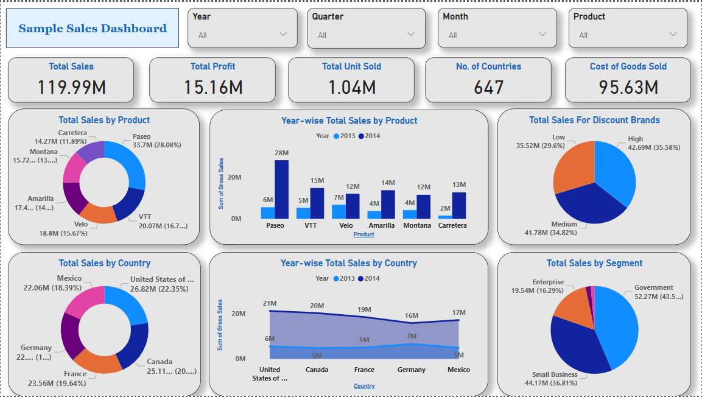

# Task8: Simple Sales Dashboard

This is a Power BI dashboard project designed to visualize and analyze sales performance data across product categories, regions, and time periods. The dashboard provides key insights into total sales, profit, unit sales, and customer segments using interactive visuals.

---

## Dataset Used

**File Name:** `Superstore_Sales.csv`  
**Columns Included:**  
- Order Date  
- Region  
- Category  
- Sales  
- Profit

---

## Tools Used

- **Power BI** (for dashboard development)  
- *(Optional)* Python + Pandas (for initial data cleaning and formatting)

---

## Dashboard Features

### Visuals Included:
- **Line Chart:** Sales trends over time (Month-Year)
- **Bar Chart:** Total Sales by Region
- **Donut Chart:** Sales by Category
- **Pie Charts:** Sales distribution by Segment and Discount Brand
- **Filters/Slicers:** Dynamic filtering by Year, Quarter, Month, and Product

## File Structure

```
ElevateLab-Internship/
└── Task8_Sales_Dashboard_Design/
    ├── Task8_Sales_Dashboard_Design.png   # Image preview of the sales dashboard
    ├── Task8_Insight.txt                  # Insights from Task 8 Dashboard
    └── README.md                          # Documentation for Task 8
```
## Dashboard Preview



> *The dashboard provides insights into total sales, profit, and unit distribution across multiple dimensions including year, product, country, discount level, and customer segments.*

### Key KPIs Displayed:
- Total Sales  
- Total Profit  
- Units Sold  
- Number of Countries  
- Cost of Goods Sold

---

## Key Insights

1. **Top-Selling Product:**  
   - *Paseo* led sales with **33.7M** (28.08% of total).

2. **Best Performing Country:**  
   - *United States* generated **26.82M** (22.35% of total sales).

3. **Most Profitable Segment:**  
   - *Government* segment accounted for **52.27M** (43.5% of segment sales).

4. **Discount Trend:**  
   - High discount products performed best, contributing **35.58%** to total sales.

---

## How to Use

1. Import the `Superstore_Sales.csv` file into Power BI.
2. Convert `Order Date` to a “Month-Year” format using Power Query or DAX.
3. Create the visuals using drag-and-drop from the Fields pane.
4. Apply slicers for dynamic filtering (Region, Category, Product).
5. Use color themes to highlight performance and segment performance visually.

---

## Deliverables

- Dashboard Screenshot (see `Task8_Sales_Dashboard_Design.png`)
- README Documentation
- Insight Summary (included above)

---
